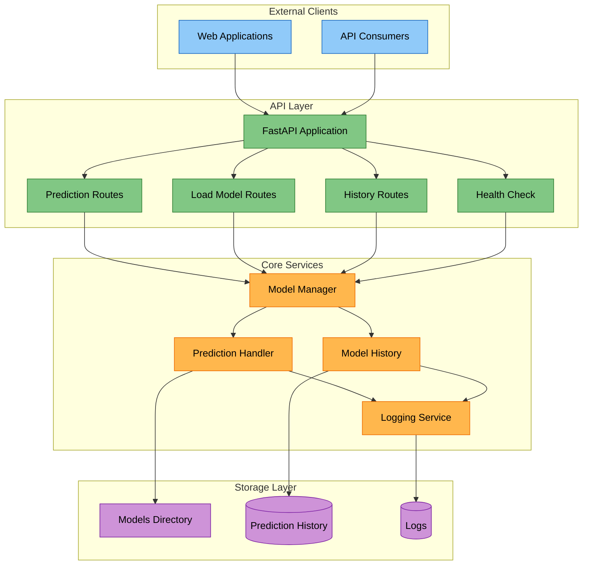

# Insider ML Engineer Challenge - Titanic Dataset

In this challenge, we developed a full API to use it with AI models.

The Titanic Dataset can be found at [Kaggle](https://www.kaggle.com/competitions/titanic/data), but in this case, it is already downloaded in the [`dataset directory`](dataset), due to its small size.

## Project structure

```text
.
├── Dockerfile
├── README.md
├── compose.yaml
├── dataset
│   ├── api_examples.json (we can test our API using this)
│   ├── gender_submission.csv
│   ├── test.csv
│   └── train.csv
├── docs (Kaggle submissions)
│   ├── rf_submission.csv
│   ├── submissions.png
│   └── svc_submission.csv
├── models
│   ├── best_rf_pipeline.pkl
│   └── best_svc_pipeline.pkl
├── notebooks
│   └── eda.ipynb
├── requirements.txt
├── src
│   ├── __init__.py
│   ├── api
│   │   ├── __init__.py
│   │   ├── routes.py
│   │   └── schemas.py
│   ├── core
│   │   ├── __init__.py
│   │   └── model_manager.py
│   ├── main.py
│   ├── train.py
│   └── utils.py
└── tests
    └── test_api.py
```

### API Objective



## Requirements

- Python 3.12.x
- Git LFS (recommended to be installed **before** cloning the rep)

### Git LFS

The Git LFS is mandatory to be installed in our system, otherwise, the models will appear like a hash code. In [`Git LFS docs`](https://docs.github.com/en/repositories/working-with-files/managing-large-files/installing-git-large-file-storage?platform=linux) we can find everything we should know to install it.  
It is also good practice to install the Git LFS for uploading big models to GitHub.

> PS: This step is mandatory if you cloned the project **without** having Git LFS. If it is already installed in your system, the git clone should automatically convert the hash into the "real" pickle files.

In Linux systems, especifically Debian based like Ubuntu, we can do this in the terminal running:

```bash
sudo apt update && sudo apt install git-lfs
```

Then, we must initialize Git LFS in our system:

```bash
git lfs install
```

Now, we need to pull our pickle files:

```bash
git lfs pull
```

This will download the .pkl models in place of the pointer files.

More details about the models, like its evaluation and score can be found in [`this notebook`](notebooks/eda.ipynb).

### Using Python environment

**PS: The following commands may be used on a Linux terminal.**

First, we need to create and activate our virtual environment (venv):

```bash
python3 -m venv .venv && source .venv/bin/activate
```

Then, using pip, we must download the dependecies from [`requirements.txt`](requirements.txt)

```bash
pip install --upgrade -r requirements.txt
```

### Using Conda

If you have preference for conda, 

## Training

From the root project directory, you can run the training using:

```bash
python3 -m src.train
```

The training should take a few minutes. On a laptop with 8 GB RAM, i5-1135G7 processor and Intel Iris Xe Graphics, it took $\approx$ 5 minutes.

## Running the API

Since we are using FastAPI, the API can be tested using

```bash
uvicorn src.main:app --reload
```

### Using Docker

The Dockerfile was created using ```docker init```.  
We can build and run our API Docker image using:

```bash
docker compose up --build
```

Our application will be available at <http://localhost:8000>.

## Testing the API

The default route of the API will be redirected to the docs with Swagger. We can test the API routes right from there.

### /health

Checks the API health, it tests if the service is running.

### /predict

Below we have an example of a passenger input expected for the prediction.  
Note:  

- Some values can be null, we can check the docs accordingly
- In [`api_examples.json`](dataset/api_examples.json), we can take some examples extracted from the validation set.
- `survived` may not be in input:

```json
{
    "PassengerId":661,
    "Pclass":1,
    "Name":"Frauenthal, Dr. Henry William",
    "Sex":"male",
    "Age":50.0,
    "SibSp":2,
    "Parch":0,
    "Ticket":"PC 17611",
    "Fare":133.65,
    "Cabin":null,
    "Embarked":"S"
}
```

The output will be an 0 (not survived) or 1 (survived).

### /load

Expects an input string of the .pkl name file to load a model.

### /history

Displays the history of past inputs and predictions.

## Cloud deploy (not tested)

We can build our image specifying the platform according to our CPU architecture in deploy:  

```bash
docker build --platform=linux/amd64 -t titanic-api .
```

Then, we can push it to our registry:

```bash
# this registry does not exist
docker push https://www.titanic-api.com/api
```
